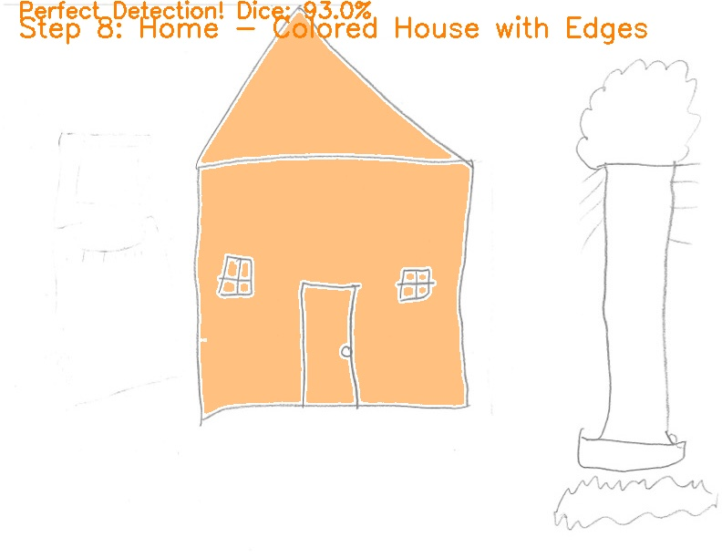

# CSC 481 — Introduction to Image Processing

**DePaul University · M.S. in Artificial Intelligence · Winter 2025**

## What the course covers

Classical image processing: filtering and edge detection, thresholding, morphological operations,
connected-component analysis, and shape analysis — no deep learning.

## Final project

**[Finding a Home from a Hand-Drawn House](final-project/)** — a pipeline that finds and highlights the
house in hand-drawn pictures using only classical techniques (Sobel edges, connected components,
convex hulls, polygon approximation), scored against hand-labeled ground truth with the Dice coefficient.

| Metric | Result |
| --- | --- |
| Images | 23 hand-drawn pictures |
| Best detection | 93% Dice |
| Success rate (Dice ≥ 50%) | 12 / 23 |

## Skills demonstrated

- Python, OpenCV, NumPy
- Sobel edge detection, erosion/dilation, connected-component analysis
- Convex hull + Douglas–Peucker polygon approximation for shape classification
- Evaluation against ground truth (Dice coefficient) and failure analysis
