# Finding a Home from a hand-drawn House

**Computer Vision Project | Image Processing & Pattern Recognition**

An automated system that detects and highlights hand-drawn houses in images using only image processing techniques like connected component analysis, shape classification, and polygon approximation techniques.

This attempt could prove that related shape detections could be used to minimize future cost by using basic image processing and pattern recognition with accuracy as an alternate means of identification when applicable.

---

## 🎯 Project Overview

This project implements a complete computer vision pipeline to detect hand-drawn houses in images by:

- Extracting edge information using Sobel operators
- Identifying connected regions via component analysis
- Classifying shapes (triangles, rectangles, pentagons)
- Matching roof-body combinations to detect complete houses
- Validating results against ground truth using Dice coefficient

**Performance**: 93% Dice coefficient on best detections | 52% overall success rate (Dice ≥ 50%)

---

## 🎨 Visual Demo

### Top Detection Results

<table>
<tr>
<td><b>Best Detection (93% Dice)</b></td>
<td><b>Second Best (90% Dice)</b></td>
<td><b>Third Best (85% Dice)</b></td>
</tr>
<tr>
<td></td>
<td>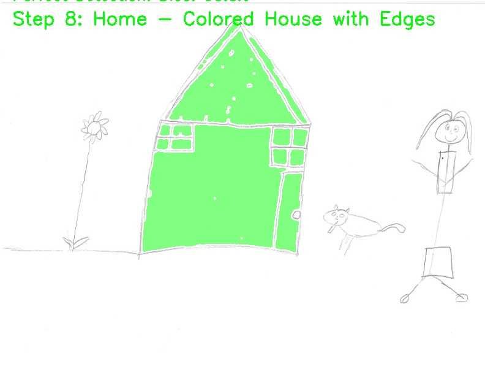</td>
<td>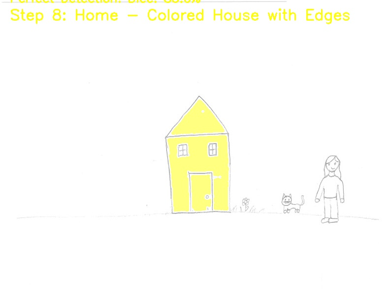</td>
</tr>
</table>

### Detection Pipeline (8 Steps)

**Example: Image 9 (93% Dice)**

<table>
<tr>
<td align="center">1. Original</td>
<td align="center">2. Red Channel</td>
<td align="center">3. Sobel Edges</td>
<td align="center">4. Connected Components</td>
</tr>
<tr>
<td>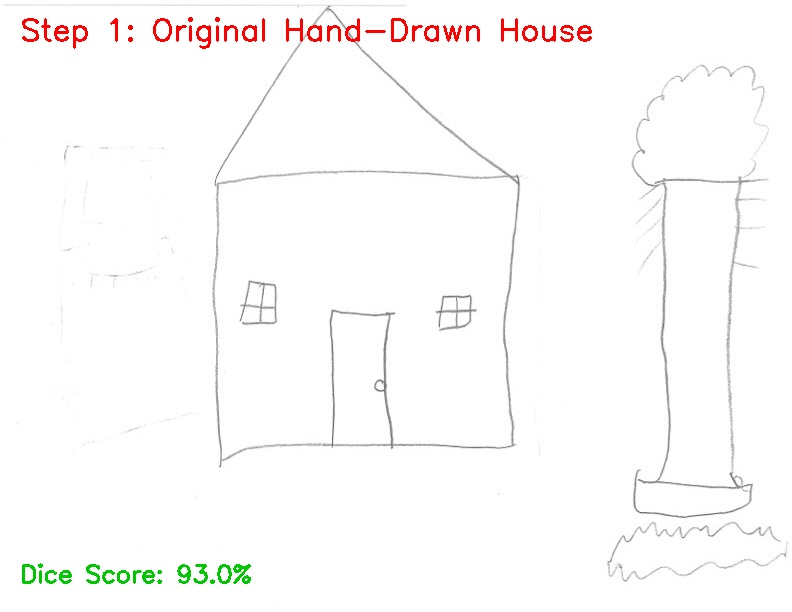</td>
<td>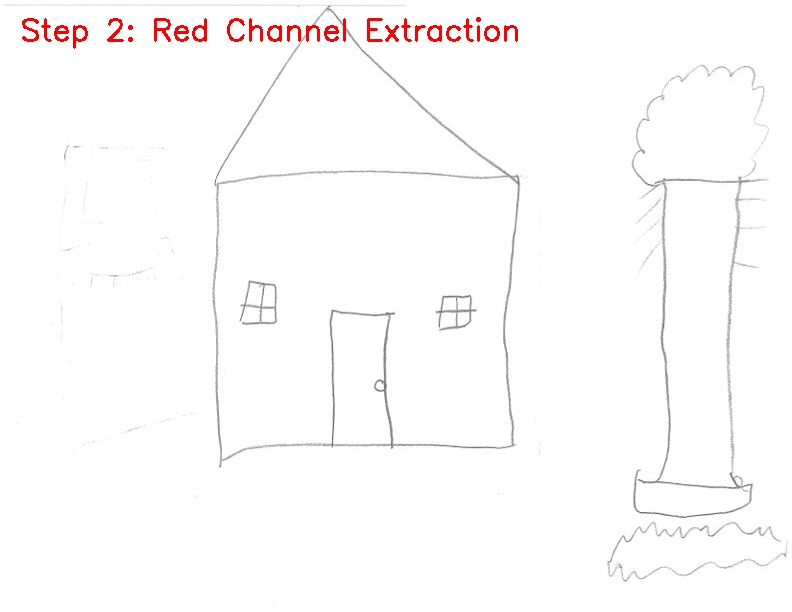</td>
<td>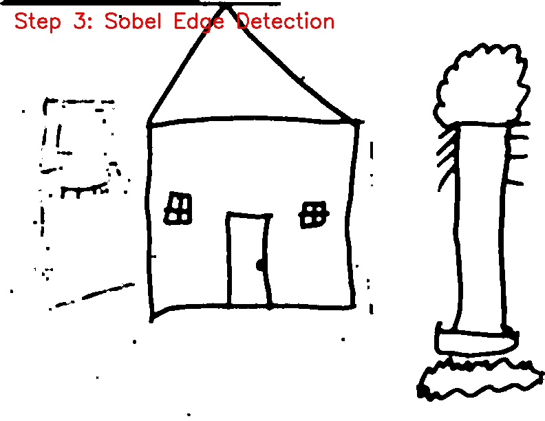</td>
<td>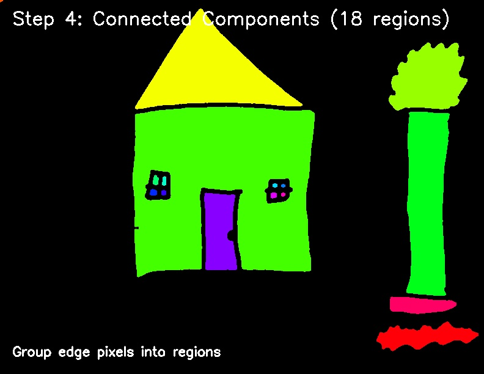</td>
</tr>
<tr>
<td align="center">5. Shape Classification</td>
<td align="center">6. House Detection</td>
<td align="center">7. Final Colored Result</td>
<td align="center">8. Home (Final)</td>
</tr>
<tr>
<td>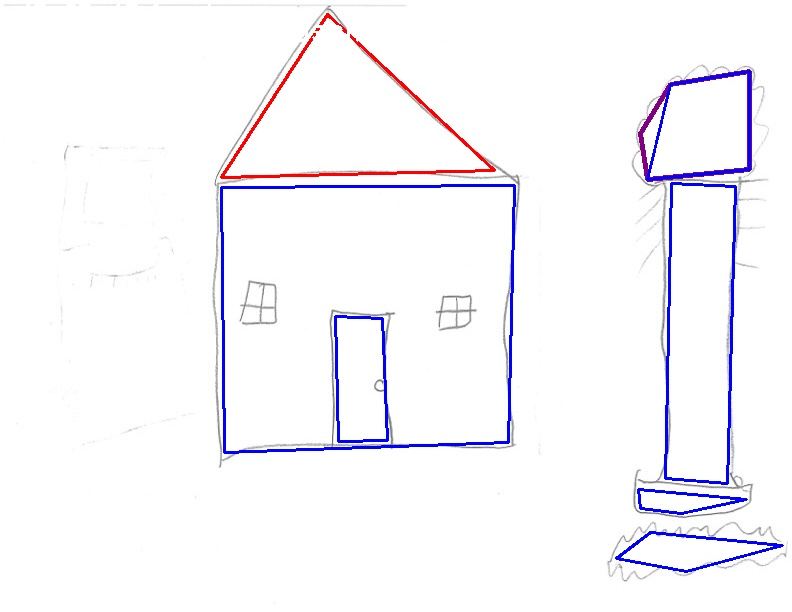</td>
<td>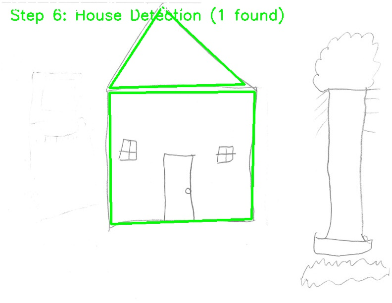</td>
<td>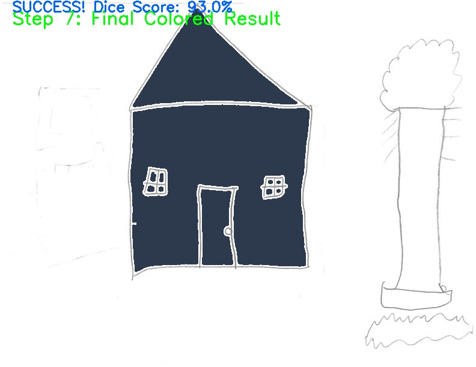</td>
<td></td>
</tr>
</table>

### Edge Cases: Near-Misses

<table>
<tr>
<td><b>Challenge Case 1 (37% Dice)</b></td>
<td><b>Challenge Case 2 (35% Dice)</b></td>
</tr>
<tr>
<td>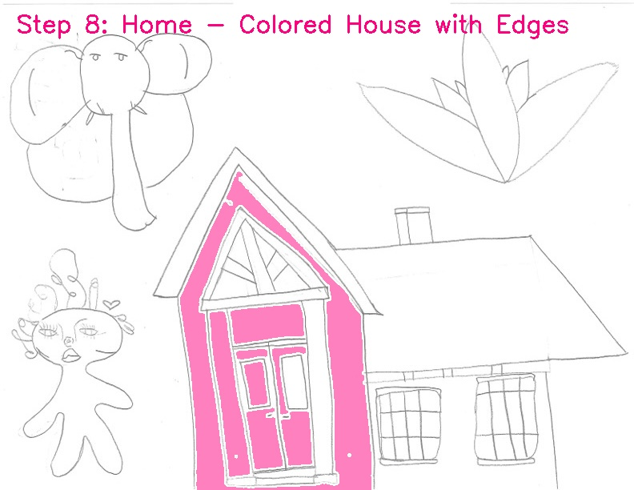</td>
<td>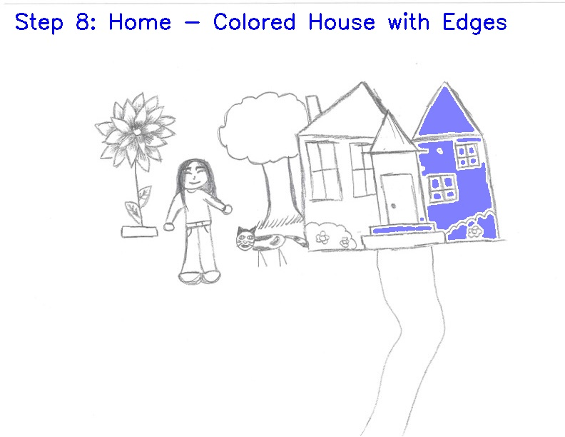</td>
</tr>
<tr>
<td>Partial detection - captured part of structure</td>
<td>Complex drawing - algorithm detected incorrect region</td>
</tr>
</table>

---

## 🔧 Technical Implementation

### Core Technologies

- **Language**: Python 3
- **Computer Vision**: OpenCV (cv2)
- **Numerical Computing**: NumPy
- **Image Processing**: Custom implementations of Sobel, erosion, dilation

### Key Algorithms

#### 1. **Edge Detection**

```python
# Red channel extraction + Sobel operator
rgb = cv2.cvtColor(img, cv2.COLOR_BGR2RGB)[:, :, 2]
sobel_edges = sobel_image(rgb)
```

#### 2. **Connected Component Analysis**

```python
# Group edge pixels into regions
num_labels, labels, stats, centroids = cv2.connectedComponentsWithStats(sobel_edges)
```

#### 3. **Shape Classification**

- Convex hull to remove concavities
- Polygon approximation (Douglas-Peucker)
- Vertex counting: 3 = triangle (roof), 4 = rectangle (body), 5 = pentagon (combined)

#### 4. **Three-Tier Detection Strategy**

1. **Primary**: Match triangular roofs with rectangular bodies
2. **Secondary**: Combine pentagonal shapes with nearby rectangles
3. **Fallback**: Detect standalone pentagonal houses

#### 5. **Validation Metric**

```python
# Dice Coefficient (more forgiving than IoU)
Dice = 2 * intersection / (area_detection + area_ground_truth)
```

---

## 📊 Results

### Performance Metrics

- **Total Images**: 23
- **Successful Detections** (Dice ≥ 50%): **12/23 (52%)**
- **Failed Detections** (Dice < 50%): **11/23 (48%)**
  - 3 complete misses (0% Dice)
  - 8 low-quality detections (1-49% Dice)

### Top Performers

| Image | Dice Score | Quality   |
| ----- | ---------- | --------- |
| 9     | **93.1%**  | Excellent |
| 11    | **90.2%**  | Excellent |
| 18    | **85.3%**  | Excellent |
| 7     | **83.0%**  | Excellent |
| 8     | **82.3%**  | Excellent |
| 3     | **80.2%**  | Very Good |
| 2     | **79.0%**  | Very Good |

---

## 🗂️ Project Structure

```
final-project/
├── src/                              # Source code
│   ├── final_detection.py            # Main detection algorithm
│   ├── functions.py                  # Helper functions (Sobel, morphology, shapes)
│   ├── generate_validated_results.py # GT validation & Dice scoring
│   ├── generate_pipeline_analysis.py # Step-by-step visualization
│   ├── generate_slideshow.py         # Top 3 + failures showcase
│   └── run_all.py                    # Master script
│
├── images/
│   ├── raw_images/                   # Original hand-drawn images
│   ├── ground_truth/                 # LabelMe JSON annotations
│   ├── result_images/
│   │   ├── validated/                # GT overlays with Dice scores
│   │   ├── success_colorful/         # Vibrant visualizations (Dice ≥50%)
│   │   └── failed/                   # Low-quality/missed detections
│   ├── pipeline_images/              # Success/failure pipeline examples
│   └── slideshow/                    # Top 3 + Top 2 failures (8 frames each)
│
└── README.md
```

---

## 🚀 Usage

### Run Complete Pipeline

```bash
python src/run_all.py
```

This executes:

1. **Detection + Validation** - Processes all images, calculates Dice scores
2. **Pipeline Analysis** - Generates step-by-step visualizations
3. **Slideshow Creation** - Creates 8-frame progressions for top performers
4. **Ground Truth Evaluation** - Compares against manual annotations

### Run Individual Components

```bash
# Just detection and validation
python src/generate_validated_results.py

# Just pipeline visualization
python src/generate_pipeline_analysis.py

# Just slideshow for top 3 + failures
python src/generate_slideshow.py
```

---

## 🎓 Key Learning Outcomes

### Computer Vision Techniques

✅ Sobel edge detection and gradient computation
✅ Morphological operations (erosion, dilation)
✅ Connected component analysis for region grouping
✅ Convex hull and polygon approximation
✅ Shape classification via vertex counting

### Software Engineering

✅ Object-oriented design (DetectedHouse, Shape classes)
✅ Modular architecture with reusable components
✅ Validation pipeline with quantitative metrics
✅ Automated visualization generation

### Evaluation Methodology

✅ Ground truth annotation (LabelMe format)
✅ Dice coefficient for similarity measurement
✅ Systematic success/failure analysis
✅ Edge case identification and documentation

---

## 💡 Challenges & Solutions

### Challenge 1: Pentagon Triage

**Problem**: Multiple detections in same image
**Solution**: Three-tier strategy prioritizing triangle+rectangle pairs over standalone pentagons

### Challenge 2: Nested Rectangles

**Problem**: Window/door rectangles confused as house bodies
**Solution**: Filter nested rectangles (containment check)

### Challenge 3: IoU vs Dice

**Problem**: IoU scores seemed low despite good visual matches
**Solution**: Switched to Dice coefficient (2×intersection/sum of areas) for better correlation with human perception

### Challenge 4: Color Vibrancy

**Problem**: Detection visualizations looked washed out
**Solution**: HSV color generation with max saturation (255) and value (255), 50/50 alpha blend

---

## 📈 Future Improvements

- [ ] **Deep Learning Integration**: CNN-based house detection for robustness
- [ ] **Multi-Scale Detection**: Handle houses of varying sizes
- [ ] **Rotational Invariance**: Detect tilted/rotated houses
- [ ] **Real-Time Processing**: Optimize for video streams
- [ ] **Mobile Deployment**: Port to iOS/Android app

---

## 👤 Author

**Aviv Katz**
Computer Science Student | Computer Vision Enthusiast

📧 Contact for collaboration or questions

---

## 📄 License

Developed as the final project for CSC 481 (Introduction to Image Processing) at DePaul University.
Code is licensed under the [Apache License 2.0](../../../LICENSE).

---

## 🙏 Acknowledgments

Special thanks to course instructors for guidance on computer vision fundamentals and feedback on algorithmic approach.

---

_Built with Python, OpenCV, and lots of edge detection_ 🏠✨
